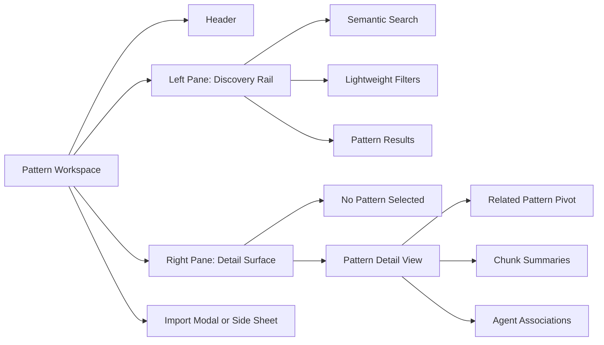
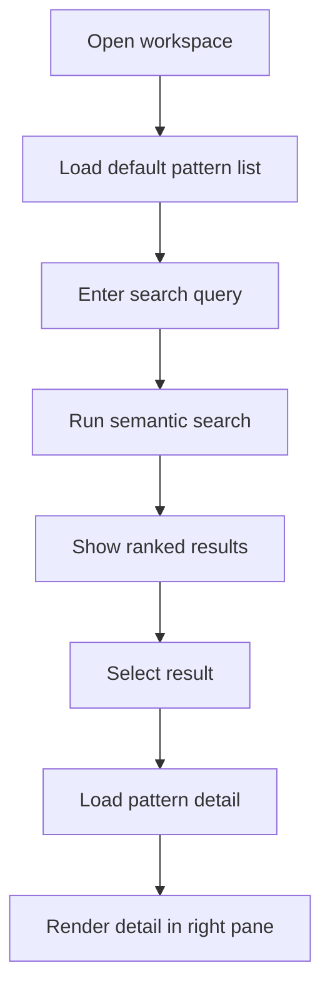
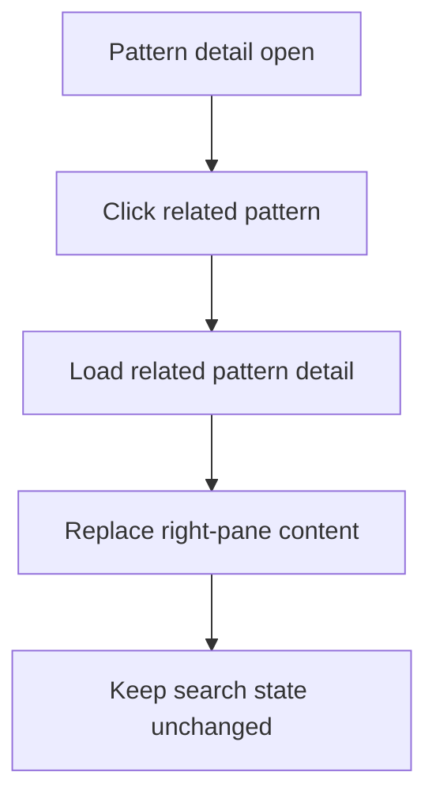
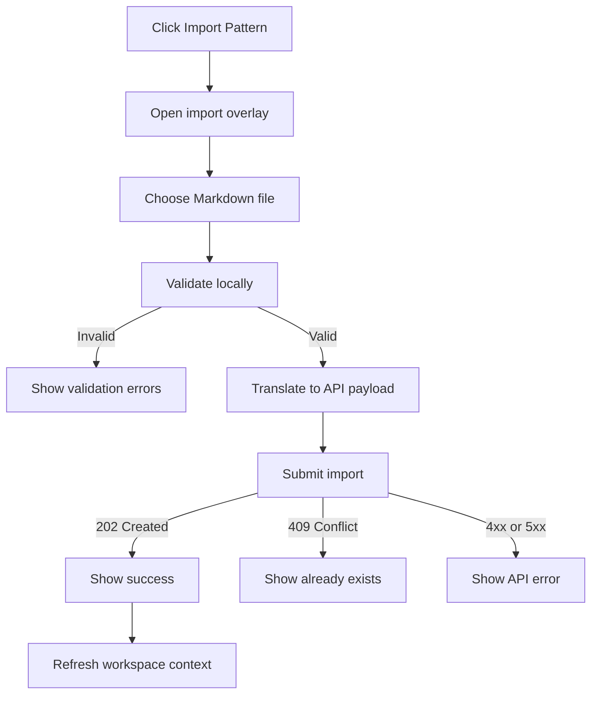

# Pattern UI Screen Map

This document maps the phase-1 use cases into concrete screens, panels, and
interaction states for the Mnemonic Admin web UI.

## Section 1: Top-Level Screen Structure

Phase 1 should use a shallow screen map. The product needs one primary route:
the pattern workspace. This keeps navigation tight and reinforces the main job
to be done, which is discovering patterns quickly and importing a new one when
needed. The workspace should be a split-pane screen. The left pane is the
discovery rail. It contains the page header, semantic search input, lightweight
filters, result summary, and the results list. The right pane is the detail
surface. It shows either an empty prompt when nothing is selected or the full
pattern view when a result is active.

The workspace has a small set of important states. On first load, it can show a
default browse state populated from the general pattern list. After the user
searches, the left pane becomes a ranked result list driven by semantic search.
Selecting a result hydrates the detail pane. If the user clicks a related
pattern inside the detail pane, the right pane updates in place and the left
pane remains stable. Import should not be a separate page. It should open as a
modal or side sheet from the workspace header so users can add a pattern and
return to discovery without leaving context.



## Section 2: Discovery Rail Structure

The left pane should support one primary workflow: enter a semantic query and
scan results quickly. The top of the rail should contain the workspace title
and the primary action to import a pattern file. Below that, the semantic
search field should be visually dominant. Filters should stay lightweight and
map directly to backend-supported fields. For phase 1, that means tags,
language, domain, and agent.

The results region should support four main states. The default state shows a
browse list when no search query is active. The loading state shows a compact
skeleton list. The empty state distinguishes between an empty library and a
query with no matches. The error state should expose retry without disrupting
the rest of the workspace. Each result row should show the pattern name, a
short description, tags, and a small amount of metadata. If semantic search
returns chunk-level context, the row should also surface the matched section
title and similarity in a compact secondary line.

## Section 3: Low-Fidelity Wireframe

This wireframe is structural. It defines placement, grouping, and hierarchy for
phase 1, not final visual design.

### Workspace

```text
+--------------------------------------------------------------------------------------------------+
| Mnemonic Admin                                                                   [Import Pattern]|
+-----------------------------------------------+--------------------------------------------------+
| Search patterns semantically...         [Go]  | Pattern Detail                                   |
|-----------------------------------------------|--------------------------------------------------|
| Filters                                       | Empty state when nothing is selected:            |
| [Tags v] [Language v] [Domain v] [Agent v]    | "Select a pattern to inspect its details."       |
|                                               |                                                  |
| Results (42)                                  | When a pattern is selected:                      |
|-----------------------------------------------|                                                  |
| > asyncapi-specification-pattern              | Name                                             |
|   Comprehensive AsyncAPI 3.0.0 specification  | Description                                      |
|   asyncapi kafka mqtt api-design agnostic     | Tags | Domain | Language | Entity Type | Status  |
|   Match: Core AsyncAPI Concepts | 0.91        |                                                  |
|-----------------------------------------------| Content                                          |
|   rest-api-specification-pattern              | -----------------------------------------------  |
|   OpenAPI-first REST API specification        | Full rendered pattern content                    |
|   openapi rest api-design agnostic            |                                                  |
|-----------------------------------------------| Chunk Summaries                                  |
|   grpc-service-definition-pattern             | - Core AsyncAPI Concepts                         |
|   Service definition and contract design      | - Basic AsyncAPI Specification                   |
|   grpc api-design agnostic                    |                                                  |
|-----------------------------------------------| Related Patterns                                 |
|                                               | - REST API Specification Pattern                 |
|                                               | - gRPC Service Definition Pattern                |
|                                               |                                                  |
|                                               | Agent Associations                               |
|                                               | - api-designer (0.8)                             |
+-----------------------------------------------+--------------------------------------------------+
```

### Import Overlay

```text
+----------------------------------------------------------------------------------+
| Import Pattern File                                                         [X]  |
|----------------------------------------------------------------------------------|
| Select one Markdown pattern file.                                                |
|                                                                                  |
| [ Choose File ]   No file selected                                               |
|                                                                                  |
| Validation status                                                                |
| - Frontmatter parsed                                                             |
| - Overview section found                                                         |
| - Pattern decorators found                                                       |
|                                                                                  |
| Import outcome area                                                              |
| - Success: pattern created                                                       |
| - Conflict: pattern already exists                                               |
| - Error: field validation or API failure                                         |
|                                                                                  |
|                                                     [Cancel] [Import Pattern]    |
+----------------------------------------------------------------------------------+
```

## Section 4: State and Flow Map

The workspace should feel stable as users move between search, inspection, and
import. The left pane should preserve the current query and result list while
the right pane updates based on selection. Import should behave like a temporary
task layered over the workspace, not a navigation event.

### Search and Select Flow

1. User lands on the workspace.
2. The left pane shows the default browse list from the pattern catalog.
3. The user enters a semantic search query and submits it.
4. The results list enters loading state, then updates with ranked matches.
5. The user selects a result row.
6. The right pane loads full pattern detail.
7. The selected result remains highlighted in the left pane.



### Related Pattern Pivot Flow

1. The user opens a pattern in the detail pane.
2. The user clicks a related pattern link.
3. The detail pane loads the selected related pattern.
4. The left pane query and result set remain unchanged.
5. The new pattern becomes the active detail context.



### Import Flow

1. The user clicks `Import Pattern`.
2. The import overlay opens on top of the workspace.
3. The user selects one Markdown file.
4. The UI validates file structure locally.
5. If validation fails, inline errors are shown and import is blocked.
6. If validation passes, the UI translates the file into the pattern create
   payload.
7. The user starts import.
8. The API response is shown as success, conflict, or failure.
9. On success, the overlay closes or offers to inspect the imported pattern.
10. The workspace refreshes the list or reruns the current search.



### Key Screen States

#### Workspace States

- Browse default state: results list populated, no query required.
- Search loading state: query is active and results are fetching.
- Search empty state: query ran successfully but returned no matches.
- Search error state: query failed and retry is available.
- Detail empty state: no pattern selected yet.
- Detail loading state: selected pattern is being fetched.
- Detail error state: selected pattern failed to load.

#### Import States

- Idle: overlay open, no file selected.
- File selected: filename shown, validation pending or complete.
- Validation error: local file issues block submission.
- Ready to import: local validation passed.
- Import submitting: action disabled, progress feedback visible.
- Import success: confirmation shown and workspace can refresh.
- Import conflict: existing-pattern warning shown.
- Import failure: API problem detail shown with actionable message.
