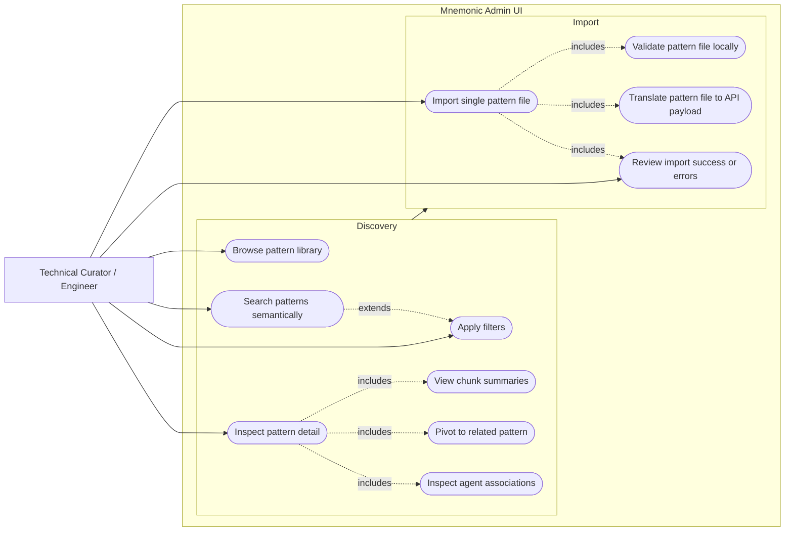

# Pattern UI Use Case Diagram

This diagram captures the agreed phase-1 scope for the Mnemonic Admin web UI.
The primary user is a technical curator or engineer who explores patterns and,
when needed, imports a single pattern file into the system.

## Diagram

## Targeted Phase-1 Use Cases

- Browse the current pattern catalog without entering a search query.
- Search patterns with semantic query support.
- Narrow results with lightweight filters such as tag, language, domain, or agent.
- Open a pattern and inspect its full metadata and content.
- Review chunk summaries and use result context to understand why a pattern matched.
- Move from one pattern to another through related-pattern links.
- Inspect agent associations as supporting context.
- Import one Markdown pattern file by validating it locally, translating it to the pattern create payload, and submitting it to the API.
- See clear import outcomes, including validation failures, conflict responses, and successful creation.

## Out of Scope for Phase 1

- Batch imports.
- Pattern editing.
- Pattern deletion.
- Separate agent management screens.
- Separate skill management screens.
- Repository-wide or folder-based ingestion jobs.
